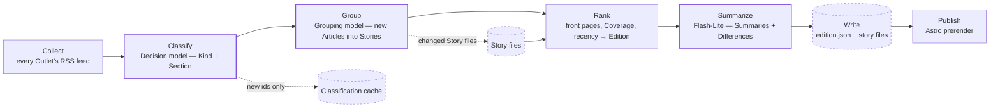

# Prisme

Prisme shows each day’s front-page news from the major French outlets, and how
each political leaning covers it — same story, every leaning, side by side.

## How it works

Every build (four a day via GitHub Actions) runs the pipeline, then commits the
result to `data/` — the git repo is the database, and CI publishes it as a
static site. Purple-stroked nodes run a language model; dashed nodes are stores
on disk — only what changed is written or re-read.

Three cheap models run the show; each pinned for traceability.

| Step | Model | Provider |
| --- | --- | --- |
| Classify (Kind + Section) and Membership checks | Jev (`typesafe/jev-1.13`) | OpenRouter — chosen by a hand-labeled benchmark |
| Group | Flash-Lite (`gemini-3.5-flash-lite`) | Gemini free tier |
| Summarize | Flash-Lite (`gemini-3.5-flash-lite`) | Gemini free tier |

Leanings are set by hand, one per Outlet, backed by sources — never classified
by a model.
