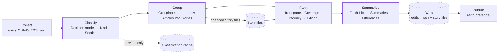

# Prisme

Prisme shows each day’s front-page news from the major French outlets, and how
each political leaning covers it — same story, every leaning, side by side.

## How it works

Every build (four a day via GitHub Actions) runs the pipeline, then commits the
result to `data/` — the git repo is the database, and CI publishes it as a
static site. Purple-stroked nodes run a language model; dashed nodes are stores
on disk — only what changed is written or re-read.



Three cheap models run the show; each pinned for traceability.

| Step | Model | Provider |
| --- | --- | --- |
| Classify (Kind + Section) and Membership checks | Jev (`typesafe/jev-1.13`) | OpenRouter — chosen by a hand-labeled benchmark |
| Group | Flash-Lite (`gemini-3.5-flash-lite`) | Gemini free tier |
| Summarize | Flash-Lite (`gemini-3.5-flash-lite`) | Gemini free tier |

Leanings are set by hand, one per Outlet, backed by sources — never classified
by a model.

## Benchmarking the Decision model (Kind + Section)

Same pattern as the grouping benchmark (issue #4): hand labels check the
models, `docs/research/decision-model-benchmark.md` carries the graded
results and the winner rule (not_news precision first — never wrongly
drop a real Article — then kind accuracy, then section accuracy).

1. **Sample** — `pnpm benchmark:export` fetches every Outlet's feeds and
   samples ~110 real headline+teaser pairs (seed 4; 70 general, 40
   “suspects” oversampled by a rare-kind heuristic — horoscopes, live
   blogs, tribunes…). Writes the gitignored `.benchmark/samples.json`
   (grader input) and `.benchmark/worksheet.md` (what you read), plus the
   committed `docs/research/decision-model-labels.json` — ids and URLs
   only, teaser text never enters git (ADR-0003).
2. **Label** — fill `kind` and `section` for every item in
   `decision-model-labels.json` (kinds: news, opinion, live, not_news).
3. **Grade** — `pnpm benchmark:grade` replays every configured model over
   the labeled sample and rewrites
   `docs/research/decision-model-benchmark.md`. Keys from `.env`:
   `OPENROUTER_API_KEY` (OpenRouter models), `JEV_API_KEY` (Jev direct),
   `CLOUDFLARE_API_TOKEN` + `CLOUDFLARE_ACCOUNT_ID` (Clef-flash) — a
   missing key just skips that model. Needs network (samples are taken
   from live feeds; grade replays the gitignored teaser text).

## Benchmarking a new Grouping model

The pinned Grouping model can be challenged anytime — issue #41 settled the
method, `docs/research/grouping-benchmark.md` carries the full methodology,
recorded results and the decision rule. The short recipe:

1. **Pick a candidate** on OpenRouter: paid (skip `:free` listings and $0
   prices — free-tier variance is what this escapes), structured outputs,
   1M context. Sort by input price.
2. **Run it from a checkout whose `data/` matches the recorded edition**
   (every results file carries its `fixtureBuiltAt` — the fixtures rebuild
   from `data/`, so new pipeline runs move the reference; re-run the
   baseline alongside when the edition moved):

   ```sh
   pnpm benchmark:grouping -- gemini/gemini-3.5-flash-lite \
                            openrouter/<vendor>/<model>
   # large-batch give-ups? try the chunked variant:
   pnpm benchmark:grouping -- openrouter/<vendor>/<model>:chunked150
   ```

3. **Read** `.benchmark/grouping/report.md` — it aggregates every recorded
   results file, so reruns extend the comparison.
4. **Apply the decision rule**: dup-seeds 0, coverage 100%, split rate ≤
   baseline on both fixtures, < $0.50/build, two valid runs for stability.

Keys come from the local `.env` (`GEMINI_API_KEY`, `OPENROUTER_API_KEY`) —
never the repo. Results land in gitignored `.benchmark/grouping/`; a
candidate that cannot answer one build call in 5 minutes is disqualified
by that fact (production aborts grouping at 60 s).
